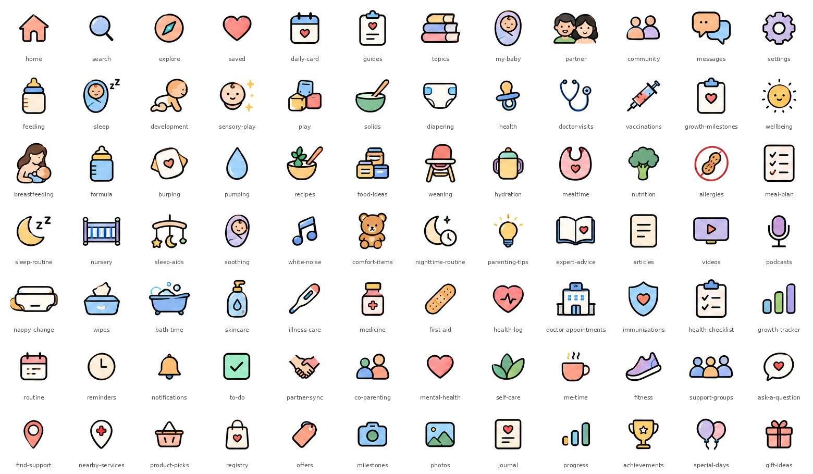

# maternity-icons

84 pastel, outlined icons for a baby and parenting app. Transparent PNGs, one per icon, served from this repo through the free jsDelivr CDN so apps (Lovable, etc.) can reference them by URL instead of bundling them.



## What's in here

```
maternity-icons/
├── icons/          84 transparent PNGs, named by slug (home.png, sleep-routine.png …)
├── icons.json      manifest: name, label, category, file, width, height for every icon
├── Icon.tsx        ready-made React component for Lovable, with typed icon names
├── preview.png     contact sheet of every icon with its name
└── README.md
```

## URL pattern

```
https://cdn.jsdelivr.net/gh/YOUR-GITHUB-USERNAME/maternity-icons@v1.0.0/icons/<name>.png
```

Example: `…/icons/sleep-routine.png`. The manifest is at `…/icons.json`.

**Why `@v1.0.0` and not `@main`:** jsDelivr caches `@main` for up to 7 days, so edits look like they "didn't work". Pin to a release tag. When you change icons, publish a new release (`v1.1.0`) and update the one `BASE_URL` line in `Icon.tsx`.

## Setting up the repo (one time)

1. On github.com → **New repository** → name it `maternity-icons` → **Public** (the CDN can't read private repos) → Create.
2. **Add file → Upload files** → drag in everything in this folder (the `icons` folder, `icons.json`, `Icon.tsx`, `preview.png`, `README.md`) → **Commit changes**.
3. Right sidebar → **Releases → Create a new release** → tag `v1.0.0` → **Publish release**.
4. Test in a browser: `https://cdn.jsdelivr.net/gh/YOUR-GITHUB-USERNAME/maternity-icons@v1.0.0/icons/home.png` should show the house.

## Using it in Lovable

Paste `Icon.tsx` in, or prompt Lovable with:

> Add this file as `src/components/Icon.tsx` [paste contents]. Use `<Icon name="…" />` for every nav and category icon. The valid names are in the `IconName` type. Don't use any other icon library for these.

Then:

```tsx
<Icon name="feeding" size={32} />
<Icon name="home" size={24} label="Home" />   // label only when there's no visible text beside it
```

Building a grid of categories from the manifest:

```ts
const res = await fetch("https://cdn.jsdelivr.net/gh/YOUR-GITHUB-USERNAME/maternity-icons@v1.0.0/icons.json");
const { icons } = await res.json();
const feeding = icons.filter(i => i.category === "feeding");
```

## Things to know

- **Resolution.** The icons were cut from a 1536×1024 sheet, so each one is roughly 60–100px wide. Keep display size at **≤ 40px** for crisp results on retina screens. Bigger than that and they soften.
- **Sizes vary.** Each PNG is trimmed tight to its icon, so they aren't square. `Icon.tsx` handles this (fixed square box + `object-fit: contain`). If you use raw `` tags, do the same, or icons won't line up.
- **Near-duplicates.** A few icons are visually identical or close, so avoid using both in the same view:
  `saved` ≈ `mental-health` (heart) · `my-baby` ≈ `soothing` (swaddled baby) · `growth-tracker` ≈ `progress` (bar chart) · `guides` ≈ `growth-milestones` (clipboard + heart)
- **Public repo.** Anyone can see and hotlink these. Fine for a prototype. Move them into the app's own `public/` folder if that ever matters.

## Categories

| Category | Icons |
|---|---|
| `navigation` | `home`, `search`, `explore`, `saved`, `messages`, `settings`, `reminders`, `notifications` |
| `content` | `daily-card`, `guides`, `topics`, `parenting-tips`, `expert-advice`, `articles`, `videos`, `podcasts` |
| `baby-care` | `my-baby`, `feeding`, `sleep`, `development`, `sensory-play`, `play`, `diapering`, `burping`, `soothing`, `comfort-items`, `nappy-change`, `wipes`, `bath-time`, `skincare` |
| `partner-and-community` | `partner`, `community`, `partner-sync`, `co-parenting`, `support-groups`, `ask-a-question`, `find-support`, `nearby-services` |
| `feeding` | `solids`, `breastfeeding`, `formula`, `pumping`, `recipes`, `food-ideas`, `weaning`, `hydration`, `mealtime`, `nutrition`, `allergies`, `meal-plan` |
| `health` | `health`, `doctor-visits`, `vaccinations`, `illness-care`, `medicine`, `first-aid`, `health-log`, `doctor-appointments`, `immunisations`, `health-checklist` |
| `growth-and-memories` | `growth-milestones`, `growth-tracker`, `milestones`, `photos`, `journal`, `progress`, `achievements`, `special-days` |
| `parent-wellbeing` | `wellbeing`, `mental-health`, `self-care`, `me-time`, `fitness` |
| `sleep` | `sleep-routine`, `nursery`, `sleep-aids`, `white-noise`, `nighttime-routine` |
| `planning` | `routine`, `to-do` |
| `shopping` | `product-picks`, `registry`, `offers`, `gift-ideas` |
